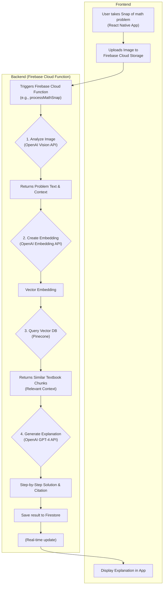

# RAG-Powered "Snap Factor" Brainstorming & Implementation Plan

This document outlines the brainstorming and high-level implementation plan for integrating Retrieval-Augmented Generation (RAG) capabilities into the Snap Factor application, focusing on K-12 math learning.

### **RAG-Powered User Stories for "Snap Factor"**

Here are six user stories that illustrate the power of RAG in this new context:

1.  **The "Homework Helper"**: "As a 7th-grade student stuck on a pre-algebra problem, I want to take a Snap of my homework, so that the app can analyze it, find similar example problems from my textbook, and provide me with a step-by-step explanation, citing the exact chapter for more context."
2.  **The "Define Mode"**: "As a student encountering an unfamiliar term like 'hypotenuse' while studying, I want to activate a 'Define Mode' to either type the word or take a Snap of it, so that the app can instantly pull the exact definition from my textbook and show it to me, along with the source citation."
3.  **The "Smart Caption"**: "As a high school student sharing a Snap of my completed calculus homework, I want the app to suggest a clever, RAG-generated caption like 'Just conquered this derivative! #MathWhiz' or 'This limit *does* exist! 🎉', so I can post it to my Story quickly."
4.  **The "Concept Explorer"**: "As a 10th-grade student studying for a geometry test, I want to type 'Pythagorean theorem' into the chat, so that the app's RAG assistant can generate a few clear examples, a simple visual diagram as a Snap, and a practice problem for me to solve."
5.  **The "Challenge a Friend"**: "As a student who just used the 'Concept Explorer' to look up the 'Pythagorean theorem,' I want to use the RAG-generated practice problem to create a 'Challenge Snap,' so I can send it to a friend and we can solve it together or compete to see who gets it right first."
6.  **The "Daily Math Challenge"**: "As a student, I want to receive a daily 'Math Snap Challenge' tailored to my grade level (e.g., 3rd-grade multiplication, 11th-grade trigonometry), so that I can solve it and share my solution."

### **High-Level RAG Architecture**

At its core, the RAG system will work by retrieving relevant information from your knowledge base (the math textbooks) *before* generating a response. This makes the AI's output more accurate, relevant, and trustworthy.

Here is a diagram of the primary workflow for a feature like the "Homework Helper":



### **Step-by-Step Implementation Plan**

#### **Phase 1: Setup & Configuration (The Groundwork)**

First, we need to get our new services and tools configured.

1.  **Secure API Keys**:
    *   Sign up for an [OpenAI API account](https://platform.openai.com/) and get your API key.
    *   Sign up for a [Pinecone account](https://www.pinecone.io/) and get your API key and environment name.
    *   **Action**: Store these keys securely. I recommend using Firebase's secret management for your Cloud Functions: `firebase functions:secrets:set OPENAI_API_KEY` and `firebase functions:secrets:set PINECONE_API_KEY`. Avoid committing them to your repository.

2.  **Install New Backend Dependencies**:
    *   In a `functions` directory (if you don't have one, you'll create it when you initialize Firebase Functions), you'll need a `package.json`. Add the necessary libraries.
    *   **Action**: I will help you set up this `package.json` and install `firebase-functions`, `firebase-admin`, `@pinecone-database/pinecone`, and `openai` when we get to that stage.

3.  **Set Up Pinecone**:
    *   **Action**: In your Pinecone dashboard, create a new **Index**. Let's name it `k12-math-textbooks`.
    *   **Configuration**:
        *   **Dimensions**: Set this to `1536` (this is the dimension for OpenAI's `text-embedding-3-small` model, which is modern and cost-effective).
        *   **Metric**: Use `cosine` similarity, as it works well for comparing text embeddings.

#### **Phase 2: Building the Knowledge Base (Data Ingestion)**

This is the "R" in RAG—retrieval. We need to scrape, process, and embed the textbook content. This is a one-time setup that you'll run locally or in an environment like Google Colab.

1.  **Scrape Textbooks**:
    *   **Tooling**: We'll write a Python script using libraries like `requests` and `BeautifulSoup` to systematically scrape the K-12 math textbooks from `openstax.org`.
    *   **Process**: The script will navigate the site, extract the text content from each page, and save it locally.

2.  **Chunk the Data**:
    *   **Strategy**: Raw text is too large to be effective. We'll process the scraped text, breaking it into smaller, meaningful chunks. A good strategy is to chunk by section or even by paragraph, keeping headings as metadata.
    *   **Metadata**: For each chunk, we must store its source: `{ "text": "...", "metadata": { "book": "Pre-Algebra", "chapter": "3", "section_title": "Solving Equations" } }`. This metadata is crucial for citations later.

3.  **Create & Upsert Embeddings**:
    *   **Action**: Using the same Python script, we will:
        1.  Loop through each text chunk.
        2.  Call the OpenAI Embeddings API to convert the text into a vector.
        3.  Use the Pinecone client to "upsert" (upload/insert) the vector into your `k12-math-textbooks` index, along with its text content and metadata. We'll do this in batches for efficiency.

#### **Phase 3: Developing the RAG Backend Service (The Brains)**

This is where the magic happens. We'll create a Firebase Cloud Function to handle the RAG logic.

1.  **Create a Cloud Function**:
    *   **Action**: We'll define a new **Callable Cloud Function** named `getMathExplanation`. Callable functions are easy and secure to call directly from your app.

2.  **Implement the Function Logic**:
    *   The function will receive a query from the app (e.g., text from a Snap, a typed question).
    *   **Step 1: Embed the Query**: Create a vector embedding for the incoming user query using the OpenAI API.
    *   **Step 2: Query Pinecone**: Use the Pinecone client to search your index with the query vector. This will return the top `k` (e.g., 3-5) most relevant text chunks from the textbooks.
    *   **Step 3: Engineer the Prompt**: Construct a detailed prompt for the GPT-4 API. This is critical for getting good results.
        ```
        You are a friendly and encouraging math tutor for K-12 students.
        A student has asked the following question: "{user_question}"

        Using the following context from their textbook, provide a clear, step-by-step explanation to help them understand the concept. Do not just give the answer. At the end of your explanation, cite the source of your information using the provided metadata.

        Context:
        - {retrieved_chunk_1_text} (Source: {retrieved_chunk_1_metadata})
        - {retrieved_chunk_2_text} (Source: {retrieved_chunk_2_metadata})
        - ...
        ```
    *   **Step 4: Call GPT-4**: Send this complete prompt to the OpenAI API.
    *   **Step 5: Return the Response**: Send the AI-generated explanation back to the app.

#### **Phase 4: Frontend Integration (The Experience)**

Finally, we'll connect the app to our new backend service.

1.  **Update UI**:
    *   **Action**: We will design and build the UI components for interacting with the RAG features (e.g., a "Get Help" button on the Snap editor, a dedicated "Math Helper" chat interface).

2.  **Connect to Backend**:
    *   **Action**: We'll create a new service file (`src/services/firebase/rag.service.ts`) to handle calling our `getMathExplanation` Cloud Function.

3.  **Manage State**:
    *   **Action**: We'll create a new Redux slice (`ragSlice.ts`) to manage the state of RAG interactions, including `isLoading`, `explanation`, and `error` states.

4.  **Display Results**:
    *   **Action**: We'll build a new component to beautifully render the formatted explanation from the AI, making sure to display the citations clearly. 