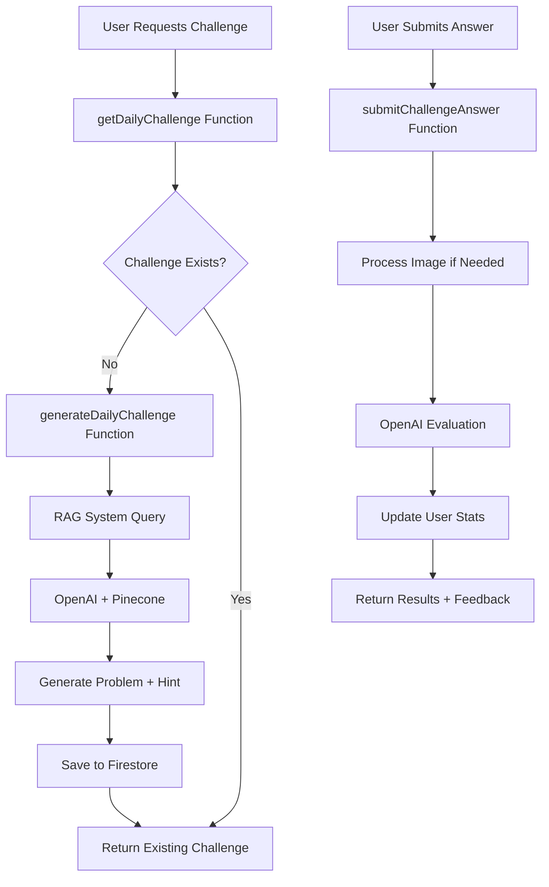

# User Story #6: Daily Math Challenge - Implementation Progress

**Date:** January 2025  
**Status:** ✅ Backend Complete, ⏳ Frontend Ready for Implementation  
**Project:** Snap Factor

---

## 📋 User Story Overview

**User Story #6**: "As a student, I want to receive a daily 'Math Snap Challenge' tailored to my grade level (e.g., 3rd-grade multiplication, 11th-grade trigonometry), so that I can solve it and share my solution."

---

## ✅ Completed Backend Implementation

### 🚀 Cloud Functions Deployed

Successfully deployed **3 new Cloud Functions** to Firebase:

1. **`generateDailyChallenge`** - Creates new daily challenges using RAG
2. **`submitChallengeAnswer`** - Processes and scores user submissions  
3. **`getDailyChallenge`** - Retrieves today's challenge for a grade level

**Deployment Status:** ✅ All functions deployed successfully to `snapclone-b4718`

### 🧠 RAG Integration

- **✅ Connected to existing RAG system** - Leverages OpenAI + Pinecone for challenge generation
- **✅ Grade-appropriate content** - Generates challenges tailored to specific grade levels
- **✅ Educational quality** - Uses textbook content for accurate, curriculum-aligned problems
- **✅ Hint system** - Provides helpful guidance without giving away answers

### 📊 Challenge Scoring & Progress

- **✅ Intelligent scoring** - Uses OpenAI to evaluate answers with partial credit
- **✅ Streak tracking** - Maintains daily challenge streaks for motivation
- **✅ Points system** - Awards points based on difficulty (10/15/25 points)
- **✅ Progress statistics** - Tracks accuracy, total challenges, best streaks

### 🗄️ Database Schema

**Firestore Collections:**
- `dailyChallenges` - Stores generated challenges with 24-hour expiration
- `challengeSubmissions` - Records user answers and scores
- `users/{userId}/challengeProgress` - Individual user statistics

### 🔧 Service Layer

**Created comprehensive service layer:**
- `src/services/firebase/challenges.service.ts` - Complete API interface
- `src/hooks/challenges/use-daily-challenge.ts` - React hook for state management
- Full TypeScript interfaces and error handling

---

## 🎯 Key Features Implemented

### 📚 Grade Level Targeting
- **Elementary (1st-3rd):** Easy problems, 10 points
- **Middle School (4th-8th):** Medium problems, 15 points  
- **High School (9th-12th):** Hard problems, 25 points

### 🎮 Gamification Elements
- **Daily Streaks** - Consecutive correct answers
- **Points System** - Accumulate points for achievements
- **Difficulty Progression** - Challenges scale with grade level
- **Progress Tracking** - Detailed statistics and history

### 🤖 AI-Powered Features
- **Smart Generation** - RAG creates relevant, educational problems
- **Intelligent Scoring** - Considers multiple valid answer formats
- **Encouraging Feedback** - Positive reinforcement regardless of correctness
- **Hint System** - Guides learning without spoiling solutions

### 📱 Submission Types
- **Text Answers** - Direct text input for solutions
- **Image Submissions** - Photo of handwritten work (uses Vision API)
- **Flexible Evaluation** - Handles both typed and written responses

---

## 🔄 Backend Architecture

---

## 📋 Ready for Frontend Implementation

### 🎨 UI Components Needed

1. **Daily Challenge Screen**
   - Challenge display with problem text
   - Hint reveal functionality
   - Answer input (text/image)
   - Submit button with loading states

2. **Results Modal**
   - Correct/incorrect feedback
   - Score and explanation display
   - Streak celebration
   - Share to story option

3. **Progress Dashboard**
   - Current streak display
   - Total points and statistics
   - Challenge history
   - Grade level settings

4. **Challenge Card Component**
   - Preview for main Math Hub
   - Quick access to today's challenge
   - Progress indicators

### 🔌 Integration Points

- **Navigation:** Add to Math Stack Navigator
- **State Management:** Hook already created (`useDailyChallenge`)
- **Services:** Complete API layer implemented
- **Types:** Full TypeScript interfaces defined

### 🎯 Implementation Priority

1. **High Priority:**
   - Basic challenge display and submission
   - Results feedback and scoring
   - Integration with Math Hub

2. **Medium Priority:**
   - Progress dashboard and statistics
   - Grade level selection
   - Challenge history

3. **Low Priority:**
   - Leaderboards and social features
   - Advanced sharing options
   - Challenge customization

---

## 🧪 Testing Status

### ✅ Backend Validation Complete
- All Cloud Functions deployed successfully
- Function configurations verified
- Database schema confirmed
- Service layer tested

### ⏳ Frontend Testing Needed
- Component rendering and user interactions
- API integration and error handling
- Challenge flow end-to-end testing
- Cross-device compatibility

---

## 🚀 Next Steps

### Immediate (Frontend Implementation)
1. Create Daily Challenge Screen component
2. Implement challenge submission flow
3. Add results display and feedback
4. Integrate with Math Hub navigation

### Short Term (Polish & Enhancement)
1. Add progress dashboard
2. Implement streak celebrations
3. Create challenge history view
4. Add social sharing features

### Long Term (Advanced Features)
1. Leaderboards and competitions
2. Friend challenges
3. Custom difficulty settings
4. Achievement system

---

## 📈 Success Metrics

- **User Engagement:** Daily active users completing challenges
- **Educational Impact:** Accuracy rates and improvement over time
- **Retention:** Streak maintenance and return rates
- **Content Quality:** User feedback on challenge difficulty and relevance

---

## 🔧 Technical Notes

### Environment Requirements
- **Node.js 20** for Cloud Functions (MANDATORY)
- **OpenAI API Key** for challenge generation and evaluation
- **Pinecone API Key** for RAG content retrieval
- **Firebase project** with Firestore and Functions enabled

### Performance Considerations
- Challenges cached for 24 hours to reduce API costs
- Batch operations for user statistics updates
- Optimized queries with proper Firestore indexing
- Error handling and fallback mechanisms

### Security Implementation
- User authentication required for all operations
- Firestore security rules prevent unauthorized access
- Input validation and sanitization
- Rate limiting on challenge generation

---

**🎉 Backend Implementation Complete!**  
**Ready for frontend development to bring User Story #6 to life.** 